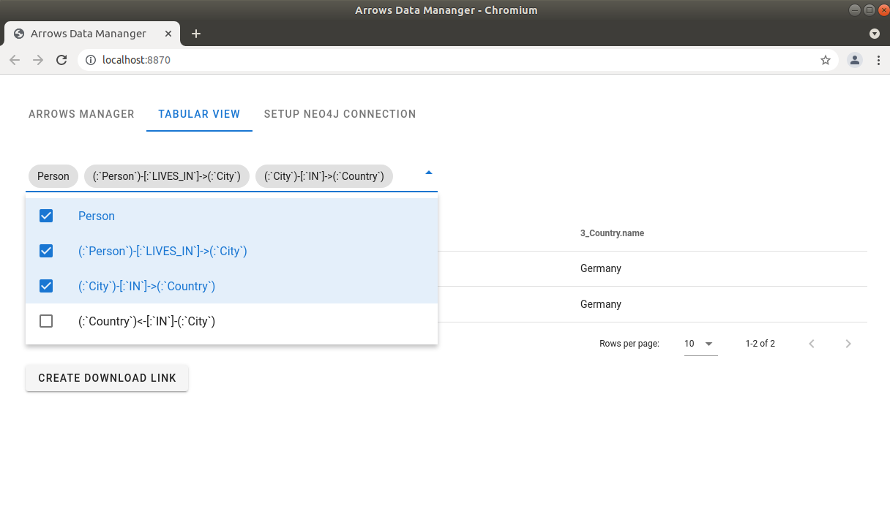

# Arrows Data Manager
A UI allowing for building a Neo4j graph (Data/Metadata repository) by pushing json content generated with [arrows.app](https://arrows.app).
If you are not familiar with arrows, there is a concise [tutorial](https://www.youtube.com/watch?v=ZHJ-BrKJ8A4) on youtube.  
    A tabular data viewer with download csv functionality is provided as well to fetch you linked data in tabular format.

**AUTHOR:** [Alexey Kuznetsov](https://www.linkedin.com/in/alexey-kuznetsov-b67b8175/)

## What are Neo4j/Graph Databases, and why do they matter?
If you're new to graph databases, checkout Neo4j [getting started page](https://neo4j.com/developer/graph-database/) 
and documentation, watch tutorials and inspirational videos on [Neo4j youtube channel](https://www.youtube.com/channel/UCvze3hU6OZBkB1vkhH2lH9Q),
read [reflection on graph db blog post](https://julianspolymathexplorations.blogspot.com/2021/02/neo4j-graph-databases-intro.html) 
by one of my former colleagues.

### In a nutshell
1) Neo4j **nodes** are similar to *records* (rows) in relational databases or spreadsheets
2) Neo4j **node labels** vaguely correspond to table names (though a node can have multiple labels)
3) Neo4j **links (relationships)** are ways of pointing from a record to one or more others 
(akin to "foreign keys" or "join tables" in relational databases)
4) Neo4j includes a **query language named Cypher**, akin to SQL (but much more powerful!)

## How to set up Neo4j
The best way to set up neo4j for the application is to run a Docker container with Neo4j: see [appendix A](Appendixes.md) 

*Other ways to set up Neo4j:*
* Install [Neo4j Desktop application](https://neo4j.com/download-center/#desktop)
* Install [Neo4j Community server](https://neo4j.com/download-center/#community) 
on your computer - Windows10 or Linux. You will 
also need [Java11](https://www.oracle.com/java/technologies/javase-jdk11-downloads.html), if 
don't have it already.

*Note: for methods above you would need to additionally 
[install apoc library](https://neo4j.com/labs/apoc/4.1/installation/)* to make 
**Arrows Data Manager** app work. 

*Other ways to get started with Neo4j:* 
* Super-simple method for beginners: get a [free account
at the Neo4j sandbox](https://neo4j.com/sandbox/);
* Also simple but more persistent method: get a [free/paid mananged cloud-based Neo4j Aura account](https://neo4j.com/cloud/aura/) 
* Use a pre-made VM machine image that contains Neo4j, 
for example [Bitnami](https://bitnami.com/stack/neo4j)

*Note: the last 3 methods do not support (as of Dec2021) apoc library(with apoc.custom) that is required for **Arrows Data Manager**.

## How to setup Arrows Data Manager application
The easiest way to get the application up and running is to install on Unix with python >= 3.6 pre-installed.
1) Clone the repository
2) Run ``` source setup.sh``` to create virtaul environment, install dependencies and enable the required Jupyter extensions. 
(Uncomment the first line of setup.sh ```sudo apt install python3-venv``` if venv is not installed)
3) Run ``` source deploy.sh``` (Update the values of NEO4J_HOST, NEO4J_USER, NEO4J_PASSWORD in deploy.sh if you want 
to change the default Neo4j database host and credentials used by the app)
4) Access the web application at http://localhost:8868/

## How to use the app
### Neo4j connection:
After accessing http://localhost:8868/ you should see the app on 'Arrows Manager' tab:


Go to 'Setup Neo4j Connection' tab if you need to change Neo4j host and credentials or clear the database from all the data:


If the default settings of the app are provided with valid host and credentials, 
the app would connect to the database at startup automatically.

### Working with data:

Access https://arrows.app on the web and create your data:


Select all the data in arrows (Ctrl+A), copy to clipboard (Ctrl+C), paste in the TextArea 
of the Arrows Data Manager app on Arrows Manager tab and click on 'Load Text':


Instead of using the text area to load data, you could opt to use the upload file 
functionality to upload data from arrows json file stored on disk. Note: in case 
the file name of the file you are loading is the same as of one of already uploaded 
files, the content of the previously uploaded file will be replaced with the new one.


Note: csv file are also allowed for upload. The first line of the csv must be 
property names (column name = property name). Each row would be loaded as a node 
and the filename will be used as the label for these nodes.

When selecting a loaded 'file' with a checkbox, one can see the summary of nodes 
in the file(s).
Also 'Delete' and 'Edit' buttons become enabled. 'Delete' button will 'undo' 
addition of the content from the 'file' in the database, 'Edit' will copy the 
json contents of the 'file' back to the text area, from where a user could 
copy it back to arrows.app, edit there and bring back in the database via 
the text area if required.


You can now observe the data designed in arrows loaded into the neo4j database the app is connected to:


If at some point in the future you need to add information to your graph like:


You follow the same process - copy the content, paste into the text area, click 'Load Text'. You will see a new 'file' was added:


In the graph database the data data will be reflected as well, but since 
the 'Frank' node was already there, it won't be created anew, but the existing 
node would get linked to node 'Ann' as per the new data:


Note: the default functionality of the app uses all the properties of a node to 
merge data, so be aware that if in the new data the 'Frank' node would have 
additional property (like 'age' or 'sex') - it would not get merged on to the 
existing node, but a new node would be created. To avoid issues like that, 
handle additional information about a node in a separate node related to main 
one as depicted in the image below.


Or setup properties to merge nodes on explicitly using the MERGE_ON SETUP sub-tab:


On the 'Labels' sub-tab one could select a label to get an arrows-formatted json of 
data attributed to the selected label (including or excluding neighbors depending on 
the checkbox). 
Note: The positioning on the nodes in arrows may be not very user-friendly(simple grid), 
so the user might need to drag the nodes around a little to see the context.


### View and download data in tabular format:
One the 'Tabular View' tab one can find a dropdown menu, where the data of interest can be selected. 
In the first step the choice would be from 1 of the labels of data that exist in the database:


After selecting a label, by clicking outside of the dropdown menu, you can see the 
data fetched from the database and returned as a table:


The dropdown would be updated with options of further data selection from the data 
that is linked to the already selected:


Let's select some more data:


Then we'll get the following table:


Finally we can download the table by clicking on 'Create download link', and then on the url that appears below:


Note: The main purpose of the app is to enable managing knowledge or small but
highly connected metadata. Performance of the app may go down when working with 
large data (> 10 000 nodes).